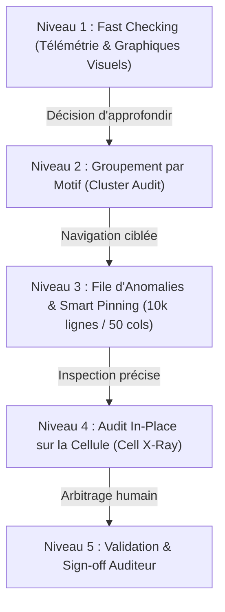
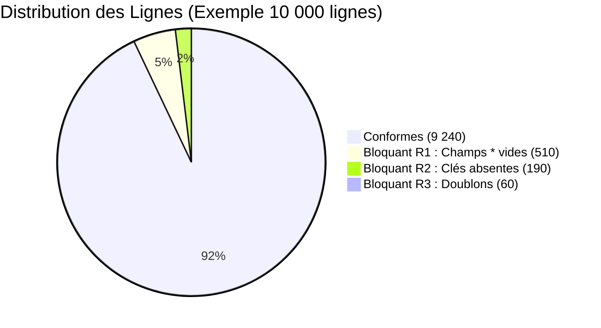
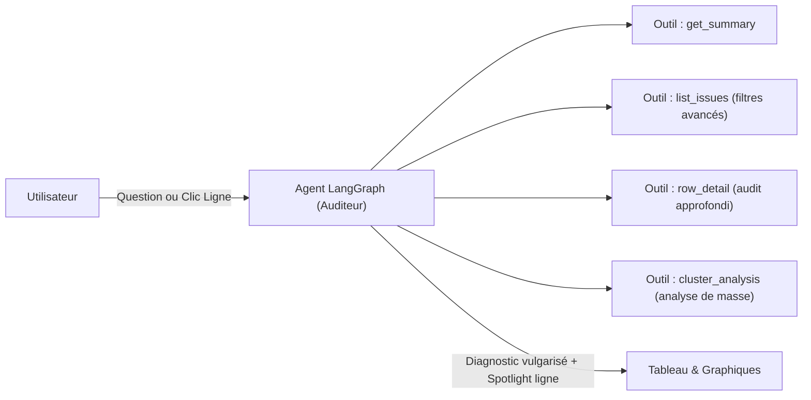

# Plan Directeur : Agent Auditeur Qualité de Données (Migration Copilot)

> **Rôle unique et exclusif** : Agent d'audit rigoureux, garantissant la conformité totale des classeurs de migration SAP S/4HANA avant injection dans le Cockpit de migration.  
> **Objectif utilisateur** : Permettre à un utilisateur non-expert d'auditer 10 000+ lignes et 50+ colonnes en quelques minutes, sans jargon technique et sans scroll interminable.

---

## 1. Architecture en Entonnoir (Du Macro au Micro)

L'expérience d'audit est conçue en 3 temps : **Vérifier vite $\to$ Cibler les motifs $\to$ Auditer sur place**.



---

## 2. Niveau 1 : Fast Checking (Graphiques & Télémétrie Visuelle)

Pour 10 000 lignes, l'utilisateur a besoin de savoir en **5 secondes** si le fichier est catastrophique ou presque prêt.

### Graphiques clés à intégrer en haut de page :

1. **Jauge de Risque Simulation Cockpit** :
   - Pourcentage de conformité globale (ex. **91 %**).
   - Statut immédiat : 🟢 *Prêt pour simulation* | 🟡 *Anomalies mineures* | 🔴 *Rejet garanti*.
   
2. **Graphique de Répartition des Anomalies par Gravité & Règle** :
   - Barres comparatives empilées :
     - **Bloquant Cockpit (Severe Plum)** : R1 (champs obligatoires `*` manquants) + R2 (clés orphelines bloquantes) + R3 (doublons de clés).
     - **Avertissements (Ambre)** : Clés parents non référencées, formats inhabituels.
     - **Conformes (Brand Sage)** : Lignes valides.

3. **Radar d'Impact par Colonne (Pareto des erreurs)** :
   - Graphique à barres horizontales identifiant les 5 colonnes qui concentrent 80 % des erreurs :
     *Exemple : `Person responsible*` (420 erreurs) | `Valid-to date*` (180 erreurs) | `Profit center*` (12 doublons).*
   - **Interactivité** : Cliquer sur une barre filtre instantanément le tableau sur cette colonne précise.



---

## 3. Niveau 2 : Groupement par Motifs (Cluster Audit)

Sur 10 000 lignes, une erreur n'est jamais isolée : c'est presque toujours un **problème de masse** (ex. extraction incomplète d'un ERP source).

### Principe :
Au lieu d'afficher 500 lignes distinctes, l'agent regroupe les anomalies par signature :
- **Grappe A** : *« 320 lignes ont le champ 'Person responsible' vide »*.
- **Grappe B** : *« 45 lignes font référence à la Société 'FR01' qui n'existe pas dans le référentiel »*.
- **Grappe C** : *« 18 doublons sur le code centre de profit 'PC-1002' »*.

**Gain pour l'utilisateur** : Il audite et comprend le motif en **1 clic**, évitant de vérifier 500 lignes manuellement.

---

## 4. Niveau 3 : Triage Haute Performance (10 000 lignes & 50 colonnes)

### Défi : L'impossible scroll horizontal et vertical
- **Vertical** : Scroller 10 000 lignes prend 15 minutes et crée de la fatigue visuelle.
- **Horizontal** : 50 colonnes forcent des allers-retours permanents de gauche à droite.

### Solutions innovantes :

1. **Mode "Focus Anomalies" (Triage Switch)** :
   - Bascule en un clic : masque instantanément les 9 500 lignes saines.
   - Ne conserve sous les yeux que les lignes en anomalie.

2. **Téléporteur d'Anomalies (Raccourcis Précédent / Suivant)** :
   - Boutons `[▲ Erreur précédente]` et `[▼ Erreur suivante]` (ou touches `J` / `K` au clavier).
   - Saut automatique d'une ligne en erreur à la suivante avec animation fluide.

3. **Smart Column Pinning (Projection des colonnes fautives)** :
   - La **colonne clé** (ex. *Profit center*) reste toujours épinglée à gauche.
   - Le statut qualité et la gravité restent toujours épinglés.
   - Les **colonnes saines sont repliées** automatiquement.
   - Seules les colonnes présentant une erreur sur la ligne active sont projetées au centre, sous le regard de l'utilisateur.

---

## 5. Niveau 4 : Audit In-Place sur la Cellule (Cell X-Ray)

L'audit ne se lit pas dans un document séparé : **il est incrusté directement dans la cellule**.

```
+---------------+------------------------+-------------------+----------------+
| Profit Center | Person responsible*    | Valid-to date*    | Statut Qualité |
+---------------+------------------------+-------------------+----------------+
| PC-1092       | [  VIDE (Pulsation)  ] | 31.12.9999        | 🔴 R1 Bloquant |
|               |  ↳ "Requis par SAP"    |                   |                |
+---------------+------------------------+-------------------+----------------+
| PC-2044       | M. Dupont              | 31.12.2023        | 🔴 R3 Doublon  |
|               |                        |                   |  ↳ Voir ligne 4|
+---------------+------------------------+-------------------+----------------+
```

### Fonctionnalités de la cellule augmentée :
- **Surbrillance ciblée** :
  - Vide obligatoire $\to$ halo prune doux (`severe`) avec mention *"Champ requis vide"*.
  - Doublon $\to$ pastille ambre avec bouton *"Comparer avec la ligne jumelle"*.
  - Incohérence de clé $\to$ pastille d'avertissement avec lien vers la feuille parente.
- **Inspecteur In-Place (Clic sur la cellule)** :
  - Ouvre une fiche synthétique :
    - **Pourquoi SAP refuse** (impact simulation).
    - **Règle enfreinte** (R1, R2 ou R3).
    - **Valeur actuelle** vs **Format attendu**.

---

## 6. Niveau 5 : Validation Humaine & Arbitrage ("Sign-Off")

L'utilisateur doit pouvoir acter ses décisions d'audit :
- **Bouton « Marquer comme toléré / Vérifié »** : pour les avertissements connus qui ne bloquent pas le métier.
- **Bouton « Marquer comme bloquant confirmé »** : confirme que la ligne doit être rejetée ou revue par l'équipe source.
- **Filtre par état d'audit** : *À auditer*, *Audité*, *Toléré*.

---

## 7. Rôle Précis de l'Agent LangGraph (Pur Auditeur)

L'agent IA dans LangGraph n'écrit pas dans le fichier : **il est l'expert métier consultatif de l'auditeur**.



### Capacités de l'agent IA :
- **Vulgarisation instantanée** : Traduit les règles strictes SAP en langage métier clair.
- **Diagnostic de cause racine** : Explique par exemple pourquoi 50 lignes ont échoué en même temps.
- **Synchronisation Spotlight** : Quand l'agent parle d'une ligne ou d'une grappe d'erreurs, l'interface la met en surbrillance en temps réel.

---

## 8. Étapes d'Implémentation Séquentielles

| Étape | Composant | Description |
|---|---|---|
| **Étape 1** | **Barre de Graphiques Télémetriques** | Graphiques d'impact (Jauge de risque, Pareto des colonnes, répartition par règle). |
| **Étape 2** | **Mode Focus & Navigation Haute Vitesse** | Switch "Uniquement les anomalies", boutons Précédent/Suivant d'erreur en erreur. |
| **Étape 3** | **Groupement par Motifs (Clusters)** | Onglet ou accordéon regroupant les 10 000 lignes par causes communes. |
| **Étape 4** | **Audit In-Place sur Cellule (Cell X-Ray)** | Affichage précis des cellules fautives, repli des colonnes saines, comparaison de doublons. |
| **Étape 5** | **Arbitrage & Sign-off Humain** | Boutons d'état d'audit sur chaque ligne (Vérifié / Toléré / À revoir). |
| **Étape 6** | **Enrichissement LangGraph** | Ajout d'outils d'audit par grappe et synchronisation bidirectionnelle chat $\leftrightarrow$ tableau. |
